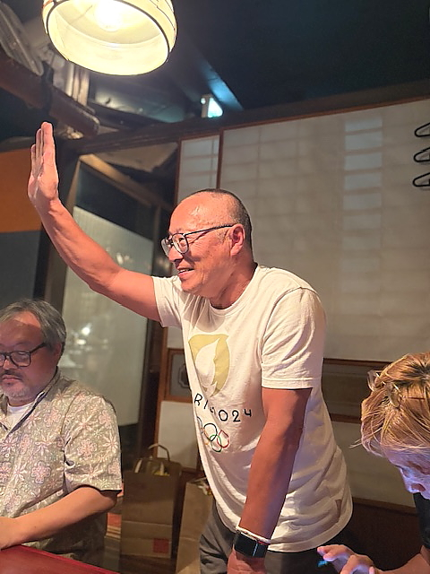
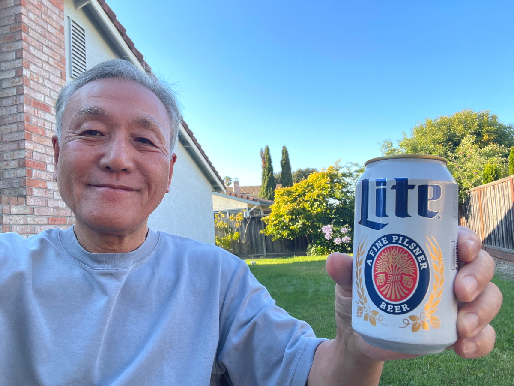

# fts_8

<html lang="ja">
 <head>
  <meta charset="utf-8" />
	 

<link href="https://cdnjs.cloudflare.com/ajax/libs/lightbox2/2.7.1/css/lightbox.css" rel="stylesheet">
 
</head>
<body>

<a href="https://torokoid.github.io/fts_home">Home</a>><a href="https://torokoid.github.io/fts">同窓会</a>><a href="https://torokoid.github.io/fts_2">Teams同窓会</a>><a href="https://torokoid.github.io/fts_3">Teams同窓会_2</a>><a href="https://torokoid.github.io/fts_4">リアル同窓会_2</a>><a href="https://torokoid.github.io/fts_5">リアル同窓会_3</a>><a href="https://torokoid.github.io/fts_6">リアル同窓会_4</a>><a href="https://torokoid.github.io/fts_7">リアル同窓会_5</a>>リアル同窓会_6

<h1><marquee behavior="alternate">!!! 2025年7月10日(木)リアル安否確認会の記録＠男前料理と五島列島直送の魚　神楽坂はずれ　無花果 !!!</marquee></h1>

                            
	

ここまで4枚は秋月さん撮影

ここまでの3枚は櫛田さん撮影

このお花は加藤秀一さん撮影
 

ここまでは羽田撮影
 

    

渡米中の杉本さんからもご連絡いただきました。
 

Tomiji Sugimoto 
10:42 
To 櫛田和光, "MASAYO, "加藤正彰さま, mm113.green@gmail.com, tomiji.sugimoto@tmg-n.com, gonnemomo@yahoo.co.jp, yoshi.0611yama@ezweb.ne.jp, m-tsuge0392@xb4.so-net.ne.jp, toshio.yokoyama@aist.go.jp, t_yaguchi@mtj.biglobe.ne.jp, youm01goka@gmail.com, shuichikato@mac.com, "YUJI, y-saito@its-jp.org, "TAKERO, mikoba254@gmail.com, 自分, "JUN, masashi.satomura.01@gmail.com, kzy.tamura@gmail.com, "KAZUYUKI  

櫛田さん、皆さん、  

今回は、出席出来ず残念でした。 
日本のクソ暑い熱帯から逃れ、カルフォルニアのフリーモントに来ております。 
ご存知の様にカルフォルニアは、日差しは強いものの日陰は涼しく快適です。 
今日のゴルフのスコアは散々でしたが、ゴルフを終え娘一家の自宅庭でのビールは最高です。 
明日はジャイアンツ対ドジャーズ戦を見に行って来ます。 
では、皆様暑い夏を頑張って乗り切って下さい。 
私はお盆明けの8/20に日本に戻ります。  

次回は出席出来るように頑張ります。  

杉本

    

MASAYO ARAI (荒井 雅代) 
7月4日(金) 13:47 
To 加藤正彰さま, mm113.green@gmail.com, kazk408@gmail.com, tomiji.sugimoto@tmg-n.com, gonnemomo@yahoo.co.jp, yoshi.0611yama@ezweb.ne.jp, m-tsuge0392@xb4.so-net.ne.jp, toshio.yokoyama@aist.go.jp, t_yaguchi@mtj.biglobe.ne.jp, youm01goka@gmail.com, shuichikato@mac.com, YUJI, y-saito@its-jp.org, TAKERO, mikoba254@gmail.com, 自分, JUN, masashi.satomura.01@gmail.com, kzy.tamura@gmail.com, KAZUYUKI  

みなさん  
 
気が付いたら、来週でしたー。 
みなさん　出欠席の変更はないですか？  
 
日時：７月１０日（木）１８：３０ 
場所：男前料理と五島列島直送の魚　神楽坂はずれ　無花果 
男前料理と五島列島直送の魚　神楽坂はずれ　無花果 （ichijiku）のご予約 - 飯田橋/居酒屋 | 食べログ 
メンバー：１５人
羽田さん、秋月さん、加藤秀一さん、渋川さん、櫛田さん、山本さん、里村さん、緑川さん、加藤さん、横山さん、矢口さん、田村さん、斉藤さん、冨沢さん、荒井  
 
予約名：斉藤  
 
変更、抜け漏れあるときは、ご連絡くださーい。  
 
荒井雅代 

                                       

  

 

<!-- フッタ -->
 <footer>
 
Copyright 2025/7/11 S.Hada

 </footer>
 
</body>
</html>
